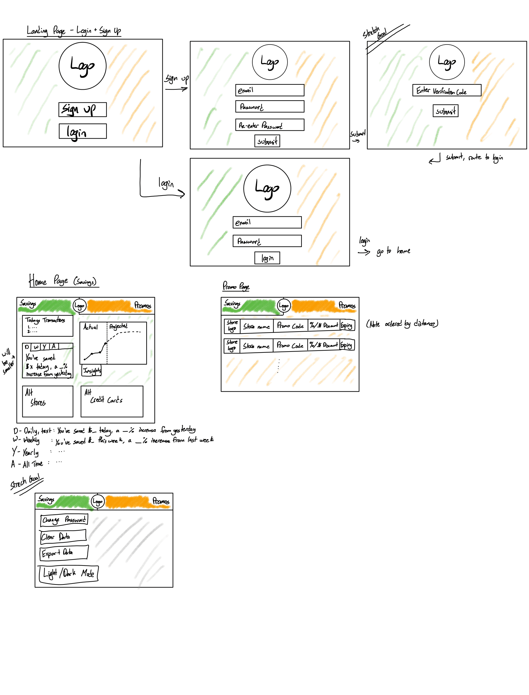
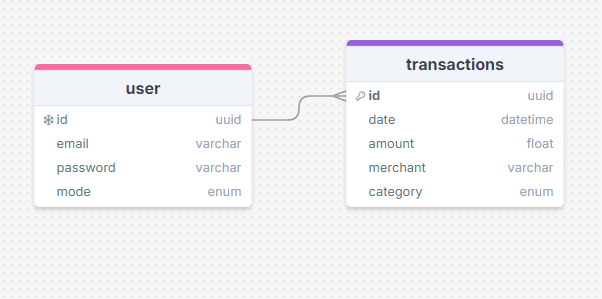

# Project Title
Fintrack

## Overview
FinTrack is a fintech application designed to help users gain deeper insights into their spending habits and optimize their financial decisions. By analyzing users' spending patterns over time and across different locations, FinTrack provides personalized recommendations for saving money, managing assets, and making smarter purchasing decisions. The app also integrates with promo code APIs to offer users discounts based on their shopping habits, and suggests alternative brands or stores to maximize value.

### Problem
Managing personal finances can be a complex and overwhelming task, especially with the myriad of spending decisions that individuals face daily. Many people struggle to track their expenses effectively, leading to inefficient spending habits that can hinder their financial goals. Additionally, while various financial tools exist, they often lack the ability to provide personalized insights based on individual spending patterns and locations. There is also a gap in the market for tools that help users anticipate upcoming expenses and suggest optimal financial products like credit cards, based on where they spend most of their money.

FinTrack aims to fill this gap by offering a comprehensive solution that not only tracks spending habits but also provides actionable insights and recommendations to help users make smarter financial decisions.

### User Profile
Frequent Shoppers
Credit card points collectors
coupon users
Budget oriented users
financial planners
business travelers

### Features
As a user, I want to track my spending habits based on the time of the month, so that I can identify patterns and adjust my budget accordingly.

As a user, I want to track my spending habits based on my location, so that I can see where I spend the most money and make informed decisions about my spending behavior.

As a user, I want to receive projections of upcoming expenses based on my assets (like car maintenance or rental income), so that I can plan my finances better.

As a user, I want to receive personalized promo codes based on where I shop most, so that I can save money on my regular purchases.

As a user, I want to get suggestions for alternative brands or stores based on my recent purchases, so that I can explore more cost-effective or better-quality options.

As a user, I want to receive recommendations for the best credit cards based on my spending patterns, so that I can maximize the rewards and benefits from my credit card usage.

As a user, I want to create an account to manage my spending habits and preferences, so that I can have a personalized experience within the app.

As a logged-in user, I want to update my spending preferences and review my spending insights, so that I can continuously optimize my financial decisions.

## Implementation

### Tech Stack
- React
- TypeScript
- MySQL
- Express
- Client libraries: 
    - react
    - react-router
    - axios
- Server libraries:
    - knex
    - express

### APIs
Banking App API 
Promo code finder API (both TBD for now)
Google Maps Places API (for nearby stores)

### Sitemap
- Login Page
- Home Page / Dashboard
- Insights
- Promo Codes

### Mockups

### Endpoints

**GET /promocodes**

Description: Retrieve a list of personalized promo codes based on the user's recent shopping history. This endpoint will analyze the user's spending patterns and return promo codes from affiliated stores or brands that align with the user's preferences.

Parameters:

userId: The unique identifier of the logged-in user (required).
location: The user's current location, specified as latitude and longitude (optional).
category: The spending category for which the user wants promo codes (optional, e.g., groceries, electronics, etc.).

[    {        "promoCode": "SAVE20",        
              "store": "Best Buy",        
              "discount": "20% off",        
              "expiryDate": "2024-12-31",        
              "category": "Electronics"    } ]

**GET /stores/nearby**

Description: Retrieve a list of nearby stores based on the user's current location. This endpoint leverages the Google Places API to find stores within a specified radius, filtered by the type of store (e.g., grocery, electronics, etc.). The response will include details such as the store name, location, and distance from the user's current location.

Parameters:

latitude: The latitude of the user's current location (required).
longitude: The longitude of the user's current location (required).
radius: The search radius in meters to find nearby stores (optional, default is 1000 meters).
type: The type of store to search for (optional, e.g., grocery, electronics, etc.).

[    {        "storeId": "ChIJN1t_tDeuEmsRUsoyG83frY4",        "storeName": "Whole Foods Market",        "location": {            "latitude": -33.870775,            "longitude": 151.199025        },        "distance": 500,        "address": "1 Macquarie St, Sydney NSW 2000, Australia"    }, ]

**GET /transactions**

Description: Fetch recent transactions from the user's bank account via the bank's API. This endpoint would pull the latest transactions and store them in the app's database for further processing, like categorizing spending or updating user insights.

Parameters:

userId: The unique identifier of the logged-in user (required).
accessToken: The OAuth token or API key for accessing the user's bank account data (required).
startDate: The start date for fetching transactions (optional, defaults to the last update date).
endDate: The end date for fetching transactions (optional, defaults to the current date).

[    {        "transactionId": "abc123",        
              "date": "2024-08-19",        
              "amount": -50.75,        
              "merchant": "Amazon",        
              "category": "Shopping"    }, ]

**POST /transactions/update**

Description: After fetching new transactions, this endpoint updates the app's database and processes the transactions. This might involve categorizing spending, linking transactions to specific stores, or updating user insights. The continuous update could be triggered by a background job or webhook.

Parameters:

userId: The unique identifier of the logged-in user (required).
transactions: An array of transaction objects fetched from the bank's API (required).

Response:
{
    "status": "success",
    "updatedCount": 15,
    "message": "Transactions have been successfully updated."
}

### Data

### Auth

Basic login functionality, no verification. Will login based on user email and password token.

## Roadmap 

- Create client 
    - React project 
    - Routing react-router-dom
    - create pages mentioned above

- Server
    - express server 
    - connect with MySQL

- DB Setup
    - DB layout/schema
    - Test sample data to ensure database is running 

- Deploy client / server 
     - Heroku 

Feature: Fetch and Display Transactions
Implement the GET /transactions endpoint to fetch transactions from the bank's API.
Display the fetched transactions on the user's dashboard.
Implement continuous updates with the POST /transactions/update endpoint.

Feature: Analyze Spending Habits
Develop algorithms to analyze spending patterns based on time of the month and location.
Display spending insights on the Insights page, with graphs and charts.

Feature: Promo Codes Integration
Implement the GET /promocodes endpoint.
Integrate the Promo Code Finder API to retrieve personalized promo codes.
Display relevant promo codes on the Promo Codes page.

Feature: Nearby Stores
Implement the GET /stores/nearby endpoint.
Use the Google Maps Places API to fetch nearby stores.
Display nearby stores on the user's dashboard with distance information.

- Clean up front end / ensure UX/UI are aesthetically pleasing 

- Bug Fixes 

- DEMO DAY 

## Nice-to-haves
- Email verification
- AI FEATURE: Auto categorization of purchases 
- AI FEATURE: Projected Spending/Saving
- AI FEATURE: Spending based on location
- AI FEATURE: Suggest credit cards based on spending habits 
- Change password 
- External login providers (google, facebook, etc)

